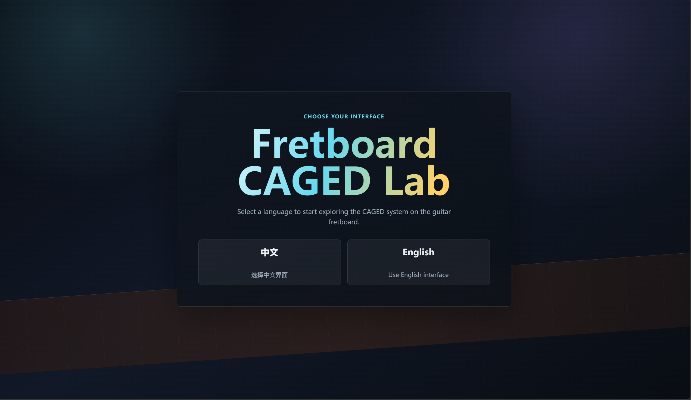
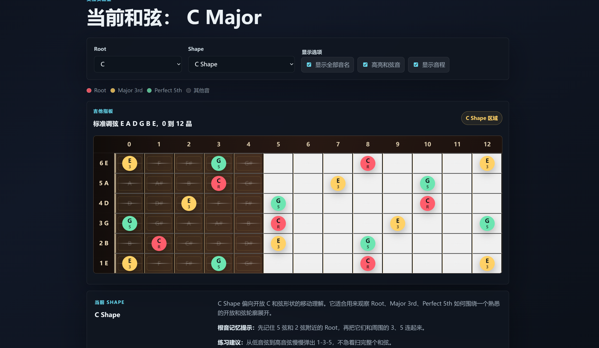
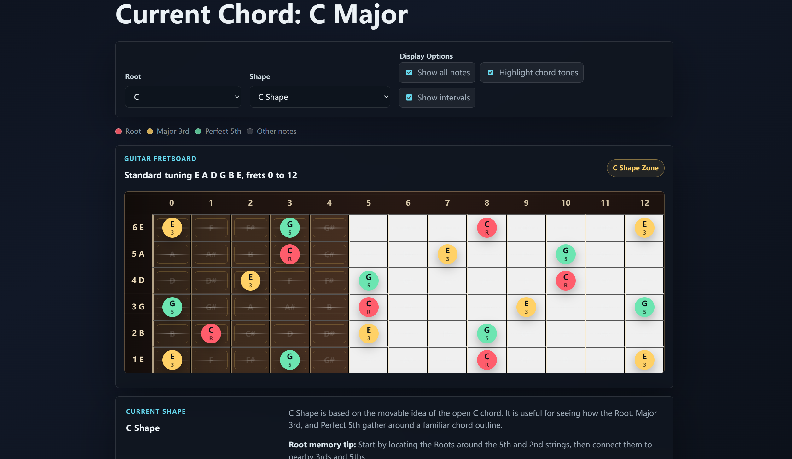

# 🎸 Fretboard CAGED Lab

> Interactive CAGED System Visualizer for Guitar Learners  
> 一个面向吉他学习者的 CAGED 系统可视化教学网页。


---

## 🌐 Live Demo / 在线预览

👉 [Open Fretboard CAGED Lab](https://1379475267-svg.github.io/fretboard-caged-lab/)

---

## 🎸 Introduction / 项目简介

**Fretboard CAGED Lab** is an interactive visual teaching demo for guitar learners.

It helps users understand the CAGED system through an interactive guitar fretboard. Users can select different root notes and CAGED shapes to see how **Root, Major 3rd, and Perfect 5th** are distributed across the fretboard.

The project also supports a bilingual interface. When users open the page for the first time, they can choose either **Chinese** or **English**, and the selected language will be saved locally for the next visit.

**Fretboard CAGED Lab** 是一个面向吉他学习者的交互式可视化教学项目。

它通过交互式吉他指板展示不同调性下 **Root、Major 3rd、Perfect 5th** 在指板上的分布，并结合 **C、A、G、E、D** 五种 CAGED Shape 的说明，帮助学习者更直观地理解和弦音、指板结构与形状连接。

项目同时支持中英文界面。用户首次打开网页时，可以选择 **中文** 或 **English**，系统会将语言偏好保存在本地，下次打开时自动使用上一次选择的语言。

---

## 🖼️ Preview / 项目展示

### Language Selection / 语言选择界面



### Chinese Interface / 中文界面



### English Interface / English 界面



---

## ✨ Features / 功能特点

- **Language Selection**  
  Choose Chinese or English when opening the project for the first time.  
  首次打开项目时，可先选择中文或 English 界面。

- **Bilingual Interface**  
  The entire interface switches between Chinese and English without mixed-language content.  
  页面内容会根据当前语言完整切换，避免中英文混排。

- **Saved Language Preference**  
  The selected language is saved with `localStorage` and will be remembered on the next visit.  
  使用 `localStorage` 保存语言偏好，下次打开网页时自动使用上次选择的语言。

- **Root Selector**  
  Select root notes from the 12-tone equal temperament system.  
  支持 C 到 B 的 12 平均律音名选择。

- **CAGED Shape Selector**  
  Switch between C Shape, A Shape, G Shape, E Shape, and D Shape.  
  支持 C Shape、A Shape、G Shape、E Shape、D Shape 切换。

- **Interactive Fretboard**  
  Display 6 guitar strings and frets from 0 to 12.  
  展示标准吉他调弦下的 6 根弦与 0-12 品。

- **Major Triad Visualization**  
  Automatically calculate and highlight Root, Major 3rd, and Perfect 5th.  
  自动计算并高亮 Root、Major 3rd、Perfect 5th。

- **Interval Display**  
  Show interval labels such as R / 3 / 5.  
  支持显示 R / 3 / 5，帮助理解和弦音功能。

- **Shape Explanation**  
  Provide explanations, root-position tips, and practice suggestions for each CAGED shape.  
  每个 CAGED Shape 都配有说明、根音记忆提示和练习建议。

- **Responsive Design**  
  Works on both desktop and mobile devices. The fretboard supports horizontal scrolling on small screens.  
  适配桌面端和移动端，手机端支持横向滚动查看指板。

- **No Dependencies**  
  Built with pure HTML, CSS, and JavaScript. No build tools or external dependencies are required.  
  纯原生 HTML / CSS / JavaScript，无需安装依赖，无需构建步骤。

---

## 🛠️ Tech Stack / 技术栈

| Technology | Usage |
|---|---|
| HTML5 | Page structure / 页面结构 |
| CSS3 | Styling, responsive layout, visual design / 样式设计、响应式布局与视觉表现 |
| Vanilla JavaScript | Fretboard rendering, language switching, interaction logic / 指板渲染、语言切换与交互逻辑 |
| localStorage | Save language preference / 保存语言偏好 |

---

## 📁 Project Structure / 项目结构

```text
Fretboard-CAGED-Lab/
├── index.html
├── style.css
├── script.js
├── README.md
└── assets/
    ├── language-gate.png
    ├── chinese-interface.png
    └── english-interface.png
```

---

## 🚀 How to Use / 使用方式

### Run Locally / 本地运行

Option 1: Open `index.html` directly in your browser.

方式一：直接双击打开：

```text
index.html
```

Option 2: Use VS Code Live Server.

方式二：使用 VS Code Live Server：

```text
Open with Live Server
```

This project has no build step and requires no dependency installation.

本项目没有构建步骤，也不需要安装依赖。

---

### Deploy to GitHub Pages / 部署到 GitHub Pages

1. Upload the project to a GitHub repository.  
   将项目上传到 GitHub 仓库。

2. Open the repository **Settings**.  
   进入仓库的 **Settings**。

3. Go to **Pages**.  
   打开 **Pages**。

4. Set Source to:

```text
Deploy from a branch
```

5. Set Branch to:

```text
main / root
```

6. Save the settings and wait for GitHub Pages to finish deployment.  
   保存后等待 GitHub Pages 构建完成。

---

## 🎼 Music Theory Notes / 音乐理论说明

This project uses the standard 12-tone equal temperament note names:

本项目使用标准 12 平均律音名：

```text
C, C#, D, D#, E, F, F#, G, G#, A, A#, B
```

The standard guitar tuning is:

标准吉他调弦为：

```text
E A D G B E
```

The major triad structure is:

大三和弦结构为：

```text
Major Triad = Root + Major 3rd + Perfect 5th
```

For example:

例如：

```text
C Major = C + E + G
```

The current version is mainly designed for visual understanding of the CAGED system and major triad distribution. It is not a full real-world fingering training system.

当前版本主要用于**可视化理解 CAGED 系统和大三和弦音分布**，并不等同于完整的真实指法训练系统。

---

## 🧠 What is CAGED? / 什么是 CAGED？

The CAGED system comes from five common open chord shapes on the guitar:

CAGED 系统来自吉他上五种常见开放和弦形状：

```text
C Shape / A Shape / G Shape / E Shape / D Shape
```

These shapes can be moved across the fretboard, helping learners connect chord shapes, root positions, and chord tones.

这些形状可以移动到不同把位，帮助学习者把零散的音名、和弦音和指板区域连接起来。

---

## 👥 Who Is This For / 适合人群

This project is suitable for:

这个项目适合：

- Guitar beginners  
  吉他初学者

- Learners studying the CAGED system  
  正在学习 CAGED 系统的人

- Players who want to understand fretboard note distribution  
  想理解指板音名分布的人

- Learners practicing Root / Major 3rd / Perfect 5th recognition  
  想练习 Root / Major 3rd / Perfect 5th 识别的人

- People interested in music visualization and creative coding  
  喜欢音乐可视化与 creative coding 的学习者

---

## 🧭 Roadmap / 后续计划

- [ ] 🎵 Minor CAGED
- [ ] 🎶 Pentatonic Scale
- [ ] 🎯 Practice Mode
- [ ] 🔊 Audio Playback
- [ ] 🧠 Fretboard Quiz
- [ ] 🗺️ Better shape position mapping
- [ ] 📸 Add more preview screenshots
- [ ] 🎬 Add a short demo GIF or video

---

## ✍️ Author / 作者

**费浩然**

Built for guitar learners and creative coding practice.

---

## 📄 License / 开源许可

This project is planned to be released under the MIT License.

本项目计划采用 MIT License 开源。