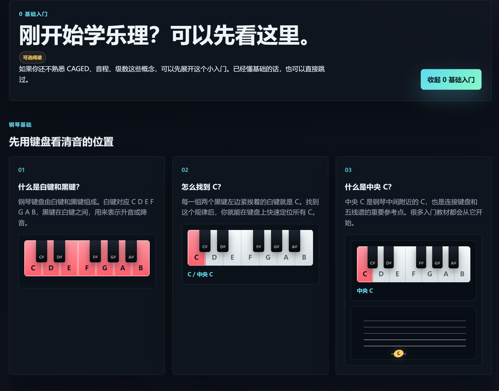
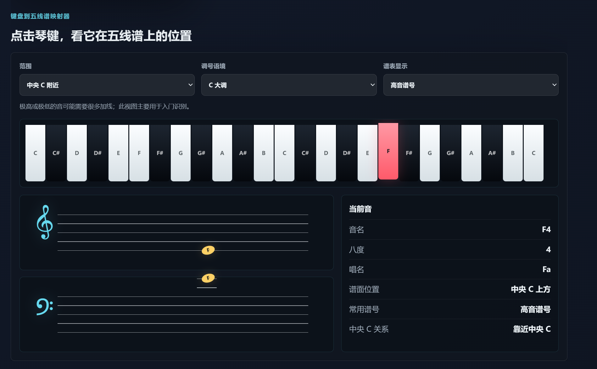
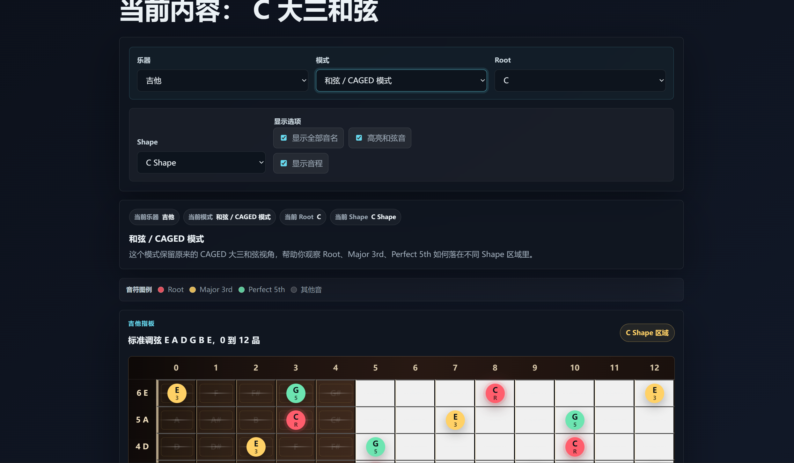
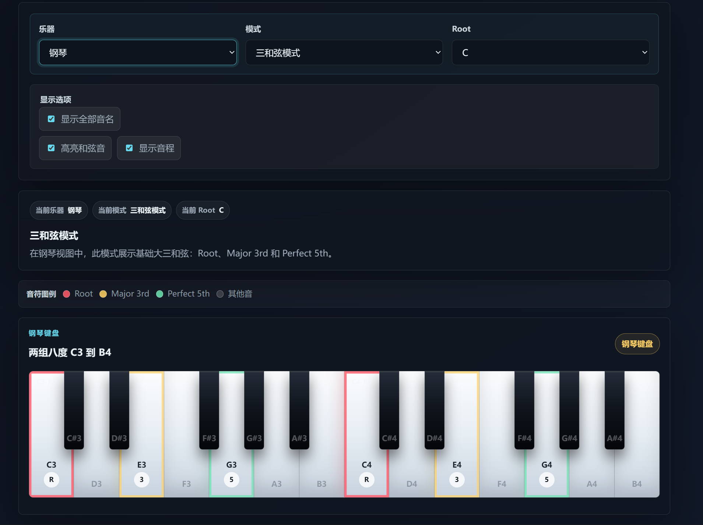

# 🎸🎹 Fret & Key Theory Lab

> 🎼 Interactive Guitar Fretboard and Piano Keyboard Music Theory Visualizer  
> 交互式吉他指板与钢琴键盘乐理可视化教学网页。


---

## 🌐 Live Demo / 在线预览

👉 [Open Fret & Key Theory Lab](https://1379475267-svg.github.io/fretboard-caged-lab/)

> The repository name may still use the original project name, while the current product identity is **Fret & Key Theory Lab**.  
> 仓库名可能仍保留早期项目名称，但当前项目定位已升级为 **Fret & Key Theory Lab**。

---

## 🎼 Project Overview / 项目概览

**Fret & Key Theory Lab** is a bilingual interactive music theory visualizer for guitar and piano learners. It connects piano keyboard layout, guitar fretboard shapes, chord tones, scale intervals, beginner music theory, staff notation basics, and guided learning routines in one lightweight web page.

CAGED is still an important part of the Guitar view, but it is no longer the identity of the whole project. The beginner section uses piano as the first teaching perspective because the keyboard lays notes out in a clear, linear way, making it easier for absolute beginners to understand note names, intervals, triads, and staff notation.

**指板与键盘乐理实验室** 是一个面向吉他与钢琴学习者的中英文双语交互式乐理可视化网页。它把钢琴键盘布局、吉他指板形状、和弦音、音阶音程、零基础乐理、五线谱入门和学习路径整合到一个轻量网页中。

CAGED 仍然是吉他视图中的重要模块，但它已经不再是整个项目的唯一定位。0 基础入门部分优先使用钢琴作为教学视角，因为钢琴键盘从低到高线性排列，更适合初学者理解音名、音程、三和弦和五线谱。

---

## 🖼️ Preview / 项目展示

### 1. 🌍 Language Gate / 语言选择界面


### 2. 🎸🎹 Instrument Gate / 乐器选择界面


### 3. ✨ Main Interface / 主界面首屏


### 4. 🌱 Beginner Basics / 0 基础入门



### 5. 🎼 Keyboard-to-Staff Explorer / 键盘到五线谱映射器



### 6. 🎸 Guitar View / 吉他视图



### 7. 🎹 Piano View / 钢琴视图



---

## 🚀 First-Time Flow / 首次使用流程

1. **🌐 Choose a language**  
   Select Chinese or English as the interface language.  
   选择中文或 English 作为界面语言。

2. **🎸🎹 Choose an instrument**  
   Choose Guitar or Piano before entering the main app.  
   进入主界面前选择要先学习的乐器：吉他或钢琴。

3. **🧭 Explore the matching theory view**  
   Guitar opens the fretboard and CAGED-based view; Piano opens the keyboard and triad-based view.  
   吉他会进入指板与 CAGED 相关视图；钢琴会进入键盘与三和弦相关视图。

4. **🌱 Optional: open Beginner Basics**  
   Beginners can expand the zero-foundation section before using the interactive lab.  
   0 基础用户可以先展开入门分区，再进入交互实验室。

---

## ✨ Core Features / 核心功能

### A. 🧩 User Experience / 基础体验

- **🌐 Language Selection**  
  Choose Chinese or English when opening the project for the first time.  
  首次打开项目时，可先选择中文或 English 界面。

- **🎸🎹 Instrument Selection**  
  Choose Guitar or Piano before entering the main learning interface.  
  进入主界面前可先选择吉他或钢琴。

- **💾 Saved Preferences**  
  Language and instrument choices are saved locally with `localStorage`.  
  使用 `localStorage` 保存语言和乐器偏好。

- **📱 Responsive Design**  
  Works on desktop and mobile devices. Fretboard and keyboard areas support horizontal scrolling when needed.  
  适配桌面端与移动端，指板和键盘区域在小屏幕上支持横向滚动。

- **🎞️ Motion Design**  
  Includes entrance animations, smooth transitions, scroll reveal effects, and reduced-motion support.  
  包含进入动画、平滑过渡、滚动出现效果，并支持减少动态效果偏好。

---

### B. 🌱 Beginner Learning / 入门学习

- **🎹 Piano-First Beginner Basics**  
  The beginner guide uses piano as the clearest first instrument for learning music theory.  
  0 基础入门优先用钢琴作为第一教学视角。

- **🎹 Keyboard Basics**  
  Explains white keys, black keys, Middle C, note names, solfege, octaves, and the 88-key range.  
  讲解白键、黑键、中央 C、音名、唱名、八度和 88 键钢琴的大致范围。

- **🎵 C Major Basics**  
  Introduces C Major, Root, scale degrees, intervals, and the C major triad.  
  讲解 C 大调、Root、级数、音程和 C 大三和弦。

- **🎼 Staff Notation Basics**  
  Introduces treble clef, bass clef, staff lines and spaces, Middle C, note values, rests, accidentals, key signatures, time signatures, and common beginner symbols.  
  讲解高音谱号、低音谱号、五线谱的线与间、中央 C、音符时值、休止符、升降还原号、调号、拍号和常见入门音乐符号。

- **🗺️ Keyboard-to-Staff Explorer**  
  Click piano keys to see their beginner-friendly staff position, note spelling, octave, solfege, clef context, and relation to Middle C.  
  点击钢琴键，查看它在五线谱中的入门级谱面位置、音名拼写、八度、唱名、谱号语境以及与中央 C 的关系。

- **🧭 Learning Path**  
  Provides a simple step-by-step path for using the visualizer.  
  提供循序渐进的学习路径建议。

- **⏱️ 10-Minute Visual Practice Routine**  
  Offers a short practice workflow for turning visual recognition into musical memory.  
  提供一个 10 分钟可视化练习流程，帮助把“看懂”逐渐变成记忆。

> **Note / 说明：**  
> The Keyboard-to-Staff Explorer is designed as a beginner-friendly visual guide, not a full professional music engraving system.  
> 键盘到五线谱映射器主要用于入门识别和可视化理解，并不是完整的专业制谱系统。

---

### C. 🎸 Guitar View / 吉他视图

- **🧱 CAGED Shape Selector**  
  Switch between C Shape, A Shape, G Shape, E Shape, and D Shape.  
  支持 C Shape、A Shape、G Shape、E Shape、D Shape 切换。

- **🎶 Chord / CAGED Mode**  
  Visualizes Root, Major 3rd, and Perfect 5th across the guitar fretboard.  
  在吉他指板上展示 Root、Major 3rd 和 Perfect 5th。

- **📈 Scale Mode**  
  Shows common scale intervals across the fretboard.  
  在吉他指板上展示常见音阶的音程分布。

- **🎸 Interactive Fretboard**  
  Displays standard guitar tuning with 6 strings and frets from 0 to 12.  
  展示标准吉他调弦下的 6 根弦与 0–12 品。

- **💡 Shape Explanation**  
  Each CAGED shape includes a description, root-position tip, and practice suggestion.  
  每个 CAGED Shape 都配有说明、根音记忆提示和练习建议。

---

### D. 🎹 Piano View / 钢琴视图

- **🎵 Triad Mode**  
  Highlights Root, Major 3rd, and Perfect 5th on the piano keyboard.  
  在钢琴键盘上高亮 Root、Major 3rd 和 Perfect 5th。

- **📈 Scale Mode**  
  Highlights scale tones and interval labels on the keyboard.  
  在钢琴键盘上高亮音阶音和音程标记。

- **🎹 Interactive Piano Keyboard**  
  Displays a two-octave keyboard from C3 to B4 in the main piano view.  
  在主钢琴视图中展示 C3 到 B4 的两组八度钢琴键盘。

- **🔎 Interval-Friendly Layout**  
  Helps learners see semitone movement and interval distances more directly.  
  便于学习者直观观察半音移动和音程距离。

---

### E. 🧠 Shared Theory Tools / 共用乐理工具

- **🎯 Root Selector**  
  Select root notes from the 12-tone equal temperament system.  
  支持 C 到 B 的 12 平均律 Root 选择。

- **🧪 Scale Explorer**  
  Supports Major Scale, Natural Minor Scale, Major Pentatonic, Minor Pentatonic, and Blues Scale.  
  支持大调音阶、自然小调音阶、大调五声音阶、小调五声音阶和布鲁斯音阶。

- **🏷️ Interval Display**  
  Displays labels such as R / 3 / 5 in chord mode and R / 2 / b3 / 4 / 5 / b7 in scale mode.  
  支持在和弦模式显示 R / 3 / 5，在音阶模式显示 R / 2 / b3 / 4 / 5 / b7 等音程标记。

- **🎨 Tone Legend**  
  Explains Root, Major 3rd, Perfect 5th, Scale Tone, and other notes visually.  
  通过图例说明 Root、Major 3rd、Perfect 5th、音阶音和其他音。

- **🌈 Scale Sound Guide**  
  Summarizes the musical color and common use of each scale.  
  概括不同音阶的大致声音色彩和常见用途。

- **🔁 Guitar vs Piano Comparison**  
  Compares how the same theory appears on the guitar fretboard and piano keyboard.  
  对比同一套乐理在吉他指板和钢琴键盘上的不同呈现方式。

---

## 🌱 Piano-First Beginner Basics / 钢琴优先的 0 基础入门

The **Beginner Basics** section is designed for users who are new to music theory. It uses piano first because the keyboard is visually linear: notes move from low to high in a clear direction.

This section covers:

- 🎹 White keys and black keys
- 🎯 How to find C
- 📍 Middle C
- 🔤 Note names and solfege
- 🔁 Octaves
- 🎵 C Major
- 🧭 Root and scale degrees
- 🎶 Major triad structure
- 🎼 Treble clef and bass clef
- 🪜 Staff lines and spaces
- ⏱️ Note values and rests
- #️⃣ Accidentals, key signatures, and time signatures
- 🗺️ Keyboard-to-staff visual mapping

**0 基础入门** 分区面向刚开始接触乐理的用户。它优先使用钢琴进行教学，因为钢琴键盘从低到高线性排列，音的位置关系更直观。

这一部分包括：

- 🎹 白键和黑键
- 🎯 如何找到 C
- 📍 中央 C
- 🔤 音名和唱名
- 🔁 八度
- 🎵 C 大调
- 🧭 Root 和级数
- 🎶 大三和弦结构
- 🎼 高音谱号和低音谱号
- 🪜 五线谱的线与间
- ⏱️ 音符时值和休止符
- #️⃣ 升降号、调号和拍号
- 🗺️ 键盘到五线谱的可视化映射

---

## 🎸 Guitar View: What is CAGED? / 吉他视图：什么是 CAGED？

The **CAGED system** comes from the five open chord shapes: **C, A, G, E, and D**. In guitar learning, these shapes can be moved across the fretboard to help players understand chord tones and position relationships.

In this project, CAGED is treated as a **guitar-specific learning module**. It helps learners connect:

- 🎯 Root positions
- 🎶 Major 3rd and Perfect 5th
- 🧱 Shape areas
- 📈 Chord tones and scale tones
- 🧠 Fretboard memory

**CAGED 系统** 来自吉他上常见的五种开放和弦形状：**C、A、G、E、D**。在吉他学习中，这些形状可以移动到不同把位，帮助学习者理解和弦音与指板位置之间的关系。

在本项目中，CAGED 被定位为 **吉他视图中的专属学习模块**，它帮助学习者连接：

- 🎯 Root 位置
- 🎶 Major 3rd 和 Perfect 5th
- 🧱 Shape 区域
- 📈 和弦音与音阶音
- 🧠 指板记忆

---

## 🎹 Piano View: Why Keyboard Theory? / 钢琴视图：为什么用键盘理解乐理？

The piano keyboard is one of the clearest visual tools for understanding music theory. It shows notes in a straight line, making intervals, semitone movement, and chord structures easier to observe.

In this project, Piano View focuses on:

- 🎵 Triad Mode
- 📈 Scale Mode
- 🔎 Keyboard interval relationships
- 🌱 C Major and beginner-friendly theory
- 🎼 Connecting keyboard notes with staff notation

钢琴键盘是理解乐理最直观的视觉工具之一。它把音从低到高线性排列，方便观察音程、半音移动和和弦结构。

在本项目中，钢琴视图重点围绕：

- 🎵 三和弦模式
- 📈 音阶模式
- 🔎 键盘上的音程关系
- 🌱 C 大调与入门乐理
- 🎼 键盘音与五线谱的对应关系

---

## 🎵 Music Theory Notes / 乐理说明

### 🔤 12-Tone Note Names / 12 平均律音名

```text
C, C#, D, D#, E, F, F#, G, G#, A, A#, B
```

### 🎼 C Major Scale / C 大调音阶

```text
C D E F G A B
```

### 🎶 C Major Triad / C 大三和弦

```text
C E G
```

### 🧱 Major Triad Formula / 大三和弦公式

```text
Root + Major 3rd + Perfect 5th
```

### 🎸 Standard Guitar Tuning / 标准吉他调弦

```text
E A D G B E
```

### 📈 Supported Scale Intervals / 支持的音阶音程

| Scale | Intervals |
|---|---|
| Major Scale | R, 2, 3, 4, 5, 6, 7 |
| Natural Minor Scale | R, 2, b3, 4, 5, b6, b7 |
| Major Pentatonic | R, 2, 3, 5, 6 |
| Minor Pentatonic | R, b3, 4, 5, b7 |
| Blues Scale | R, b3, 4, b5, 5, b7 |

---

## 🛠️ Tech Stack / 技术栈

| Technology | Usage |
|---|---|
| HTML5 | Page structure / 页面结构 |
| CSS3 | Styling, responsive layout, visual design, animation / 样式设计、响应式布局、视觉表现与动画 |
| Vanilla JavaScript | Rendering, language switching, instrument switching, interaction logic / 渲染、语言切换、乐器切换与交互逻辑 |
| localStorage | Save language and instrument preferences / 保存语言和乐器偏好 |

---

## 📁 Project Structure / 项目结构

```text
Fretboard-CAGED-Lab/
├── index.html
├── style.css
├── script.js
├── README.md
└── assets/
    ├── language-gate.png
    ├── instrument-gate.png
    ├── main-hero.png
    ├── beginner-basics.png
    ├── keyboard-staff-explorer.png
    ├── guitar-view.png
    └── piano-view.png
```

---

## 🚀 Run Locally / 本地运行

### Option 1: Open directly / 方式一：直接打开

Download or clone the repository, then open `index.html` in your browser.

下载或克隆项目后，直接用浏览器打开 `index.html`。

### Option 2: Use a local static server / 方式二：使用本地静态服务器

```bash
git clone https://github.com/1379475267-svg/fretboard-caged-lab.git
cd fretboard-caged-lab
python -m http.server 8000
```

Then open:

```text
http://localhost:8000
```

---

## 🚢 Deploy to GitHub Pages / 部署到 GitHub Pages

This project is a static website. It can be deployed directly with GitHub Pages.

本项目是静态网页，可以直接使用 GitHub Pages 部署。

Basic steps:

1. Push the project to a GitHub repository.
2. Open repository **Settings**.
3. Go to **Pages**.
4. Select the main branch and root folder.
5. Save and wait for GitHub Pages to publish.

基本步骤：

1. 将项目推送到 GitHub 仓库。
2. 打开仓库 **Settings**。
3. 进入 **Pages**。
4. 选择主分支和根目录。
5. 保存后等待 GitHub Pages 发布。

---

## 👥 Who Is This For / 适合人群

- 🌱 Music theory beginners  
  乐理初学者

- 🎸 Guitar learners studying CAGED and fretboard notes  
  正在学习 CAGED 和指板音名的吉他学习者

- 🎹 Piano learners studying keyboard layout, triads, and intervals  
  正在学习键盘布局、三和弦和音程的钢琴学习者

- 🎼 Learners who want to connect keyboard, fretboard, and staff notation  
  想把钢琴键盘、吉他指板和五线谱联系起来的学习者

- 💻 People interested in music visualization and creative coding  
  对音乐可视化和 creative coding 感兴趣的人

---

## 🗺️ Roadmap / 后续计划

- [x] 🌐 Bilingual UI / 中英文界面
- [x] 🚪 Language selection gate / 语言选择入口
- [x] 🎸🎹 Instrument selection gate / 乐器选择入口
- [x] 🎸🎹 Guitar and Piano views / 吉他与钢琴双视图
- [x] 🧪 Scale Explorer / 音阶探索
- [x] 🎹 Piano Keyboard Visualizer / 钢琴键盘可视化
- [x] 🌱 Piano-first Beginner Basics / 钢琴优先的 0 基础入门
- [x] 🎼 Staff Notation Basics / 五线谱入门
- [x] 🗺️ Keyboard-to-Staff Explorer / 键盘到五线谱映射器
- [x] 🧭 Learning Path / 学习路径
- [x] 🌈 Scale Sound Guide / 音阶声音指南
- [x] 🔁 Guitar and Piano Comparison / 吉他与钢琴对照
- [x] ⏱️ 10-Minute Practice Routine / 10 分钟练习流程
- [x] 🎞️ Motion Design / 动态视觉设计
- [ ] 🔊 Audio Playback / 音频播放
- [ ] 🎬 Demo GIF or video / 演示 GIF 或视频
- [ ] 🎼 More accurate advanced notation support / 更完善的高级谱面支持
- [ ] 👂 Optional ear-training or quiz mode / 可选听音或测验模式

---

## 👤 Author / 作者

**费浩然**

Built for music learners, guitar / piano beginners, and creative coding practice.  
为音乐学习者、吉他 / 钢琴初学者和 creative coding 练习而构建。

---

## 📄 License / 开源许可

MIT License (planned)

This project is shared for learning, demonstration, and creative exploration.  
本项目用于学习、展示与创意探索。